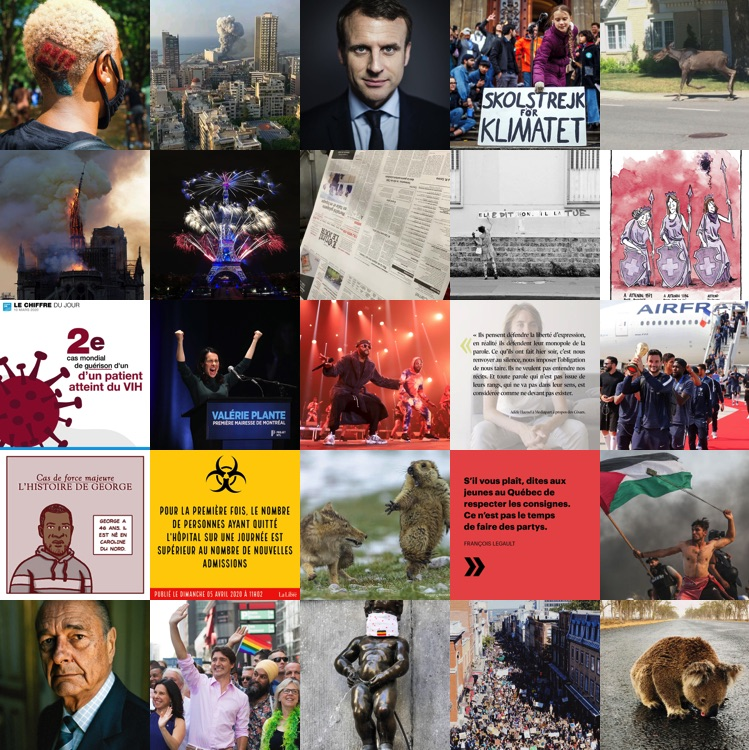
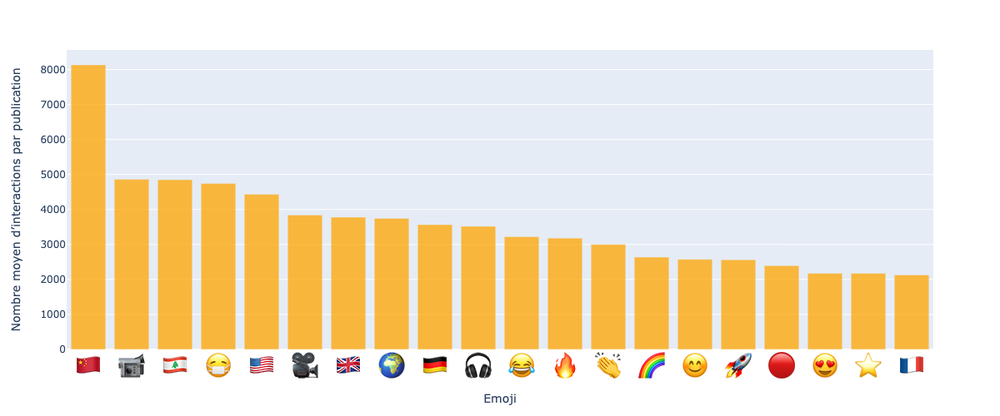
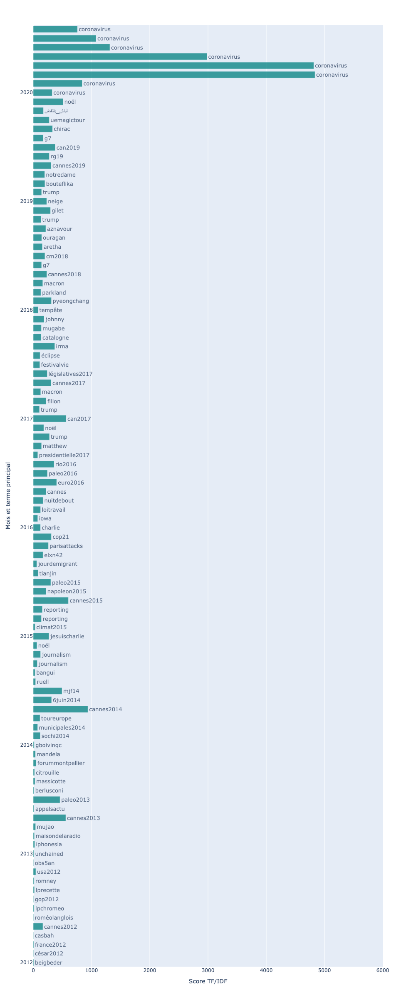

# Instagram: la «une» de l'ère mobile

Ce répertoire décrit avec plus de détails la méthodologie (avec fichiers et code) utilisée pour un article publié dans [*Les Cahiers du journalisme*](http://cahiersdujournalisme.org/V2N6/CaJ-2.6-R069.pdf) en 2021. Il s'agit d'une revue scientifique, avec comité de lecture. Les articles des *Cahiers* sont revus par les pairs. L'article que j'y ai publié s'insère dans [un numéro spécial consacré au journalisme mobile](http://cahiersdujournalisme.org/V2N6/index.html), codirigé par [Nathalie Pignard-Cheynel](https://www.unine.ch/ajm/home/professeurs-collaborateurs/pignard-cheynel-nathalie.html), [Pascal Ricaud](https://www.univ-tours.fr/annuaire/m-pascal-ricaud) et [Lara Van Dievoet](https://uclouvain.be/fr/repertoires/lara.vandievoet). Il consiste en une analyse descriptive exploratoire des dix premières années d'utilisation d'[Instagram](https://www.instagram.com/) par les médias francophones.

### Étape 1 - Collecte de données dans CrowdTangle

La première étape de la collecte de données à consisté à recueillir **toutes les publications Instagram** de 32 médias représentant un échantillon représentatif des principaux médias de l'espace francophone (France, Canada, Belgique, Suisse, Liban). Pour ce faire, j'ai utilisé [CrowdTangle](https://www.crowdtangle.com/), un outil de détection de contenu viral fourni par Facebook, à qui appartient Instagram. Il permet d'extraire des données historiques. Ainsi, toutes les publications Instagram de chacun des médias, dès lors qu'ils se sont mis à publier sur cette plateforme, si ces publications sont contenues dans CrowdTangle, ont été recueillies. La récolte a été effectuée début septembre 2020.

Le fichier [**mediasfrancoinstagram-public.csv**](mediasfrancoinstagram-public.csv) regroupe ainsi **82&nbsp;908 publications** mises en ligne dans Instagram par 32 médias francophones entre le 26 mai 2011 ([plus ancienne publication de notre échantillon](https://www.instagram.com/p/EwS94/)) et le 31 août 2020. Les champs textuels `description` et `image_text` ont été retranchés afin de respecter la propriété intellectuelle des médias concernés. Un fichier complet pourra néanmoins être transmis à tout.e chercheur.euse qui le souhaiterait (contactez-moi par [courriel](roy.jean-hugues@uqam.ca)). Ce fichier complet pourra permettre plus aisément à un.e chercheur.euse de reproduire les étapes ultérieures. Mais toute personne qui a accès à CrowdTangle pourrait puiser les publications Instagram des 32 médias francophones de notre échantillon et se créer son propre fichier, moyennant quelques heures de travail.

Le tableau ci-dessous présente la liste des médias examinés dans cette étude avec quelques métadonnées sur leurs publications.

| Compte Instagram | Pays | Abonnés (au 31 août 2020) | Nombre de publications (2011-2020) | Somme des « J’aime » | Somme des commentaires | Somme des vues |
|---|---|--:|--:|--:|--:|--:|
| FRANCE 24 | France | 1 346 479 | 6 045 | 4 360 312 | 100 563 | 18 286 023 |
| Le Monde | France | 1 242 888 | 7 486 | 14 536 874 | 178 858 | 605 326 |
| Radio France Internationale | France | 476 873 | 3 247 | 852 173 | 17 509 | 1 895 300 |
| Le Figaro 🗞 | France | 439 673 | 4 834 | 4 818 443 | 96 956 | 2 298 006 |
| Mediapart | France | 364 438 | 1 828 | 2 249 459 | 66 421 | 986 458 |
| franceinfo | France | 342 512 | 2 573 | 1 694 917 | 36 465 | 7 332 685 |
| BFMTV | France | 329 388 | 1 113 | 940 386 | 32 936 | 9 213 586 |
| Libération | France | 300 364 | 2 896 | 2 575 117 | 41 349 | 1 577 385 |
| RTL | France | 162 655 | 4 516 | 862 823 | 27 351 | 703 952 |
| Radio-Canada Information | Canada | 153 190 | 6 199 | 1 253 095 | 36 502 | 7 962 640 |
| La Presse | Canada | 138 544 | 3 705 | 688 150 | 14 737 | 96 463 |
| TF1 Le JT | France | 127 721 | 1 083 | 598 876 | 12 599 | 5 819 446 |
| La Voix du Nord | France | 122 275 | 3 385 | 1 270 199 | 18 814 | 514 416 |
| TVA Nouvelles | Canada | 115 305 | 566 | 276 348 | 13 068 | 2 568 677 |
| Ouest-France | France | 111 342 | 1 545 | 1 045 061 | 13 589 | 181 895 |
| Le Devoir | Canada | 81 356 | 4 944 | 992 823 | 21 905 | 368 407 |
| RTL info | Belgique | 72 868 | 1 854 | 730 283 | 23 380 | 1 365 645 |
| LCI | France | 65 922 | 1 497 | 308 374 | 9 675 | 6 241 371 |
| SudOuest | France | 65 566 | 727 | 418 714 | 6 524 | 49 258 |
| Le Journal de Montréal | Canada | 65 011 | 632 | 99 042 | 4 070 | 157 544 |
| RTBF | Belgique | 62 720 | 1 032 | 277 775 | 7 983 | 676 828 |
| RTS - Radio Télévision Suisse | Suisse | 57 159 | 590 | 175 038 | 4 222 | 1 295 162 |
| L'Orient-Le Jour 🗞 | Liban | 45 753 | 3 546 | 979 964 | 20 008 | 1 256 818 |
| Le Soir | Belgique | 42 903 | 4 229 | 600 543 | 12 462 | 511 872 |
| Le Temps | Suisse | 42 249 | 2 040 | 301 749 | 5 037 | 10 945 |
| Tribune de Genève | Suisse | 31 110 | 1 858 | 287 051 | 5 746 | 270 169 |
| Le Dauphiné Libéré | France | 27 540 | 810 | 111 297 | 2 025 | 60 967 |
| 24heures | Suisse | 26 167 | 1 537 | 131 546 | 3 607 | 132 621 |
| Le Monde Afrique | France | 17 610 | 369 | 32 563 | 588 | 222 |
| LaLibre.be | Belgique | 16 805 | 2 024 | 102 789 | 2 224 | 164 665 |
| Le Matin | Suisse | 14 813 | 701 | 46 880 | 1 138 | 1 273 |
| Le Soleil de Québec | Canada | 13 772 | 3 491 | 597 313 | 18 196 | 20 447 |
|  |  | *6 522 971* | *82 902* | *44 215 977* | *856 507* | *72 626 472* |

### Étape 2 - Emojis, *hashtags*, mots et *n-grams*

Une fois ce corpus constitué, le script [**instanalyse.py**](instanalyse.py) prend les champs textuels de chaque publication et crée cinq fichiers CSV, un pour regrouper tous les emojis contenus dans notre corpus, un autre pour les mots-clics, et les trois dernier (après [lemmatisation](https://fr.wikipedia.org/wiki/Lemmatisation)) pour les mots seuls, les bigrammes (paires de mots) et les trigrammes:

- [**insta-emojis.csv**](insta-emojis.csv)
- [**insta-hastags.csv**](insta-hastags.csv)
- insta-motsseuls.csv
- insta-bigrammes.csv
- insta-trigrammes.csv

Ces fichiers contiennent aussi, pour chaque élément lexical, la somme des interactions de la publication dans laquelle ils se retrouvent afin de faire une pondération de leur utilisation au lieu d'une simple somme de leurs occurrences.

Je ne partage que les deux premiers, car les trois derniers sont trop gros pour être téléversés dans github... et pour être traités dans LibreOffice!

Avec les fichiers d'emojis et de mots-clics, il est donc possible de faire un tableau croisé et de calculer les interactions moyennes pour reproduire les figures publiées dans l'article. Voici l'exemple de la Figure 4 des 20 emojis ayant suscité le plus d’interactions par publication de notre corpus de médias francophones et se retrouvant dans 100 publications ou plus.

Les fichiers des mots seuls, des bigrammes et des trigrammes ont dû être traités à l'aide de [pandas](https://github.com/jhroy/tuto-pandas/), car ils comptent respectivement 3,2 millions, 3,1 millions et 3,0 millions de lignes chacun. Le carnet jupyter [**instableaux.ipynb**](instableaux.ipynb) montre qu'un tableau croisé a été effectué dans chacun pour calculer le nombre d'occurrences de chaque mot, bigramme et trigramme, et pour les pondérer avec le nombre d'interactions des publications dans lesquelles ils ont été utilisés.

### Étape 3 - Analyse TF/IDF

Afin de repérer les termes qui se sont démarqués dans le temps parmi les publications Instagram des 32 médias francophones sélectionnés, deux analyses TF/IDF ont été effectuées.

La première tâchait de voir quels mots étaient caractéristiques des publications de chaque média; la seconde faisait la même chose, mais par mois (quels mots étaient caractéristiques de ce mois-là par rapport à l'ensemble du corpus).

Pour chaque analyse, il s'agissait de créer des fichiers .txt contenant le texte de toutes les publications pour un média ou pour un mois donné. Dans le cas de l'analyse par mois, cette opération a été effectuée par le script [**insta-parMois.py**](insta-parMois.py). Ce script créait 106 fichiers .txt (un pour chacun des mois contenant des publications Instagram au cours de la période étudiée mai 2011 à août 2020). Tous les fichiers n'ont pas été reproduits ici, à part un seul ([**2020-08.txt**](2020-08.txt) qui couvre le dernier mois du corpus) fourni en guise d'exemple.

Les deux analyses TF/IDF proprement dites ont ensuite été effectuées dans un carnet jupyter [**tfidf.ipynb**](tfidf.ipynb) qui, de son côté, produisait 32 fichiers CSV pour l'analyse par média (un par média) et 106 fichiers CSV pour l'analyse par mois (un par mois). Chacun de ces fichiers contient tous les mots du corpus avec, pour chacun, un score correspondant à son degré de spécificité pour le média ou pour le mois donné. Plus ce score est élevé, plus cela signifie que l'utilisation de ce mot est caractéristique des publications instagram de notre corpus pour ce média ou pour ce mois.

Les résultats de l'analyse par mois ont servi à produire la figure ci-dessous. Les termes représentés sont ceux dont le score TF/IDF a été le plus élevé pour chaque mois, en autant qu'il ne s'agisse pas d'un terme temporel (année ou nom du mois) ou d'un terme décrivant un des médias de l'échantillon (mediapart, tf1, etc.).

### Étape 4 - Analyse des images

Une dernière analyse a été effectuéee sur 1% des images ayant suscité le plus d'interactions pour chacun des médias du corpus. Un total de 733 images ont été téléchargées manuellement (eh oui... cette opération était sans doute automatisable, mais je n'ai pas trouvé comment).

Chaque image a ensuite analysée avec l'[API Computer Vision des Services cognitifs de Microsoft](https://docs.microsoft.com/en-us/azure/cognitive-services/computer-vision/). Pour l'image ci-dessous, tirée du [compte Instagram du Figaro](https://www.instagram.com/lefigarofr/), par exemple, l'API a retourné les renseignements se trouvant dans ce fichier: [**36887214_2965943723431332_5578156666228047872_n.json**](36887214_2965943723431332_5578156666228047872_n.json)

Deux scripts ont été utilisés à cette étape. Le script [**vision.py**](vision.py) soumettait chaque image à l'API et consignait ce qu'il lui retournait dans un fichier .json. Le script [**vision2.py**](vision2.py) lisait tous ces fichiers et examinait quelles principales catégories ou étiquettes leur étaient le plus souvent accolées par l'API.

Comme l'article dans [*Les Cahiers du journalisme*](http://cahiersdujournalisme.org/) le souligne, cette étape n'a pas permis de faire ressortir quoi que ce soit de pertinent ou d'utile. Cependant, un examen manuel de ce sous-ensemble d'images ayant suscité le plus de réactions a permis de dégager plus de sens, à savoir qu'Instagram est utilisé par les médias comme la UNE d'un journal et qu'il a des fonctions se rapprochant davantage du marketing que du journalisme.
